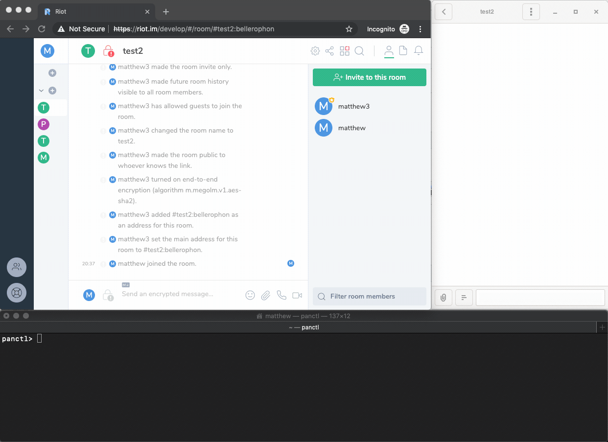

pantalaimon
===========

Pantalaimon is an end-to-end encryption aware Matrix reverse proxy daemon.
Pantalaimon acts as a good man in the midle that handles the encryption for you.

Messages are transparently encrypted and decrypted for clients inside of
pantalaimon.



Installation
============

The [Olm](https://gitlab.matrix.org/matrix-org/olm) C library is required to
be installed before installing pantalaimon.

If your distribution provides packages for libolm it is best to use those, note
that a recent version of libolm is required (3.1+). If your distribution doesn't
provide a package building from source is required. Please refer to the Olm
[readme](https://gitlab.matrix.org/matrix-org/olm/blob/master/README.md)
to see how to build the C library from source.

Installing pantalaimon works like usually with python packages:

    python setup.py install

Pantalaimon can also be found on pypi:

    pip install pantalaimon

Do note that man pages can't be installed with pip.

Usage
=====

While pantalaimon is a daemon, it is mean to be run as your own user. It won't
verify devices for you automatically, unless configured to do so, and requires
user interaction to verify, ignore or blacklist devices.

Pantalaimon requires a configuration file to run. The configuration file
specifies one or more homeservers for pantalaimon to connect to.

A minimal pantalaimon configuration looks like this:
```dosini
[local-matrix]
Homeserver = https://localhost:8448
ListenAddress = localhost
ListenPort = 8009
```

The configuration file should be placed in `~/.config/pantalaimon/pantalaimon.conf`.

The full documentation for the pantalaimons configuration can be found in
the man page `pantalaimon(5)`.

Now that pantalaimon is configured it can be run:

    pantalaimon --log-level debug

After running the daemon, configure your client to connect to the daemon instead
of your homeserver. The daemon listens by default on localhost and port 8009.

Note that logging in to the daemon is required to start a sync loop for a user.
After that clients can connect using any valid access token for the user that
logged in. Multiple users per homeserver are supported.

For convenience a systemd service file is provided.

To control the daemon an interactive utility is provided in the form of
`panctl`.

`panctl` can be used to verify, blacklist or ignore devices, import or export
session keys, or to introspect devices of users that we share encrypted rooms
with.
